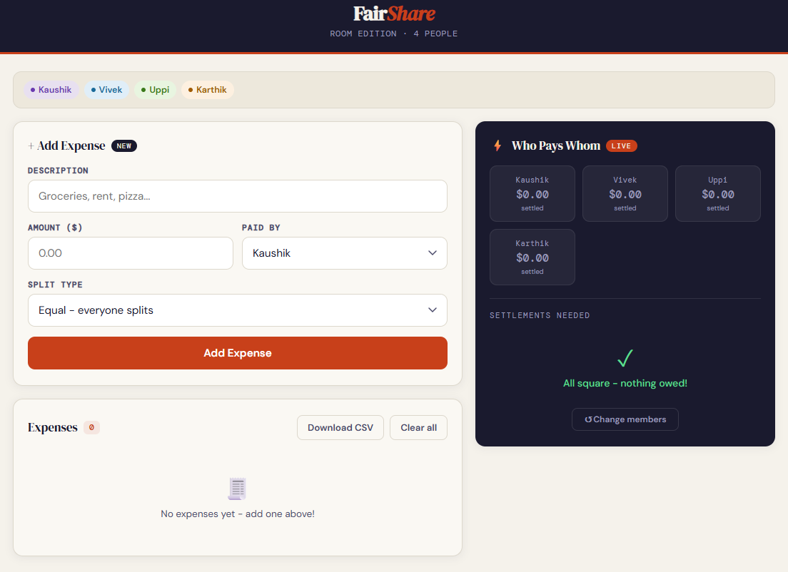

# FairShare - Room Edition

FairShare is a local-first roommate expense splitter for tracking shared costs, calculating exact cents, and exporting settlement reports without accounts, servers, or setup.

[Live Demo](https://pavankalyan-codes.github.io/fair-share) · [Source Code](https://github.com/pavankalyan-codes/fair-share)



---

## Why I Built This

Splitting roommate expenses sounds simple until the group has a mix of rent, utilities, groceries, personal items, partial participants, and rounding edge cases. I built FairShare to make that workflow transparent: add expenses, choose how each bill is split, and see exactly who owes whom.

The project is intentionally small and local-first. It runs as static HTML/CSS/JS, stores data in the browser, and exports CSV reports that can be opened in Excel or Google Sheets.

---

## Features

- **2-10 roommates** - flexible setup for small shared households
- **3 split modes** - equal split, custom share ratios, or selected participants only
- **Cent-safe math** - calculations operate in cents to avoid floating-point drift
- **Live settlements** - balances and who-pays-whom instructions update immediately
- **Persistent local sessions** - restore your room's expenses after refresh via `localStorage`
- **CSV export** - download expenses, balances, and settlement instructions
- **Mobile-first UI** - quick to use at checkout or while entering receipts

---

## Engineering Highlights

- **Modular vanilla JavaScript** - no framework or bundler; responsibilities are split by layer.
- **Pure core logic** - money allocation, balances, and settlements live in `js/core.js`.
- **Fixture-backed tests** - unit tests validate edge cases and a real exported CSV fixture.
- **Local-first privacy** - no login, no backend, and no network calls for user data.
- **Clean adapters** - storage, rendering, and CSV export are isolated from the core math.

---

## Getting Started

No installation needed. Open `index.html` directly in your browser.

```bash
git clone https://github.com/pavankalyan-codes/fairshare.git
cd fairshare
start index.html
```

Or host it with GitHub Pages:

1. Go to the repo's **Settings** -> **Pages**
2. Set source to `main` branch, `/ (root)`
3. Visit `https://pavankalyan-codes.github.io/fairshare`

---

## Project Structure

```text
fairshare/
|-- index.html
|-- assets/
|   `-- fairshare-preview.png
|-- css/
|   `-- styles.css
|-- js/
|   |-- app.js       # App orchestration and event wiring
|   |-- config.js    # Constants, symbols, and palette
|   |-- core.js      # Pure money and settlement logic
|   |-- csv.js       # CSV export helpers
|   |-- dom.js       # DOM rendering and view helpers
|   `-- storage.js   # localStorage adapter
|-- tests/
|   |-- check-syntax.js
|   |-- core.test.js
|   `-- test-data.csv
|-- LICENSE
|-- package.json
`-- README.md
```

---

## Tests

The app has no runtime dependencies. `package.json` only provides convenience scripts.

```bash
npm test
npm run check
npm run verify
```

The test suite covers:

- cent conversion and rounding
- equal, selected, and weighted split edge cases
- pairwise settlement netting
- fixture validation from `tests/test-data.csv`
- exported total, balance, and settlement consistency

---

## Manual QA Checklist

Before publishing or posting:

- [ ] Setup flow: add, remove, validate blank names, validate duplicate names
- [ ] Expense flow: add equal split, custom shares, and selected participants
- [ ] Settlement flow: verify balances update after add, remove, and clear-all
- [ ] Persistence: refresh page, restore session, start fresh, reset members
- [ ] CSV export: download file and confirm expenses, balances, and settlements
- [ ] Mobile viewport: check setup, expense form, and settlement card on narrow screens
- [ ] GitHub Pages: verify live demo loads CSS, JS, and preview image

---

## Architecture

FairShare follows a small layered structure:

- `js/core.js` contains pure functions for cents, split allocation, balances, settlements, and legacy normalization.
- `js/storage.js` wraps `localStorage` so persistence is separate from app behavior.
- `js/dom.js` owns DOM caching, rendering, visual feedback, and symbol application.
- `js/csv.js` builds and downloads CSV exports.
- `js/app.js` coordinates state, events, and the flow between the adapters.

This keeps the math testable and lets UI/storage/export concerns change independently.

---

## How to Use

1. Enter the names of everyone splitting expenses.
2. Add expenses with description, amount, payer, and split type.
3. Watch balances and settlement instructions update live.
4. Export a CSV report when the group is ready to settle.

| Split Mode | How it works |
|---|---|
| **Equal** | Amount divided across everyone |
| **Custom Shares** | Set a ratio per person, such as `2 : 1 : 1` |
| **Selected People** | Pick who is included and exclude everyone else |

---

## Data & Privacy

All data is stored locally in your browser using `localStorage`. Nothing is sent to a server. Clearing browser data or hitting **Change members** wipes the session.

---

## Tech Stack

| Layer | Choice |
|---|---|
| UI | Vanilla HTML / CSS / JS |
| Fonts | Google Fonts |
| Storage | Browser `localStorage` |
| Tests | Node.js built-in `assert` |
| Dependencies | None |

---

## Roadmap

- [ ] Edit expenses after adding them
- [ ] Expense categories
- [ ] CSV import / restore from export
- [ ] Copy settlement summary
- [ ] Recurring expense templates

---

## Suggested Commit Milestones

```bash
git add index.html css js
git commit -m "refactor: split app into structured modules"

git add tests package.json
git commit -m "test: add fixture-backed core logic tests"

git add README.md LICENSE .gitignore assets
git commit -m "docs: polish project for showcase"
```

---

## LinkedIn Post Draft

I built **FairShare**, a local-first roommate expense splitter that runs entirely in the browser.

It supports equal splits, custom shares, selected participants, live settlement instructions, session restore with `localStorage`, and CSV export for Excel or Google Sheets.

Engineering highlights:

- vanilla HTML/CSS/JS with no framework or backend
- modular architecture with pure core money logic
- cent-safe calculations for awkward split amounts
- fixture-backed unit tests using real exported CSV data
- privacy-first: no login, no server, no account required

I built this to make shared expenses transparent and easy to settle.

---

## License

MIT - see [LICENSE](LICENSE).
